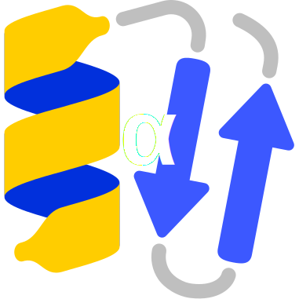

#  Alphafoldology

Welcome to the **Alphafoldology** project!

Alphafoldology is an interactive, curated genealogy map and database of tools, papers, models, and derivatives tracing their origins to AlphaFold 2 and the structural biology AI revolution.

🌐 **[Visit the Live Webpage](https://karelberka.github.io/Alphafoldology/)**

## Features
- **Interactive Tool Directory:** Browse through dozens of tools related to protein folding, protein design, structural biology, and molecular dynamics.
- **Genealogy Map:** Visually explore how different models and repositories derive from or connect to one another.
- **HuggingFace Integration:** Find weights, spaces, and directly access models hosted on the HuggingFace Hub (🤗).
- **Social Pulse:** Quick links to see what the community is talking about regarding `#alphafoldology`, protein design, and structural biology on platforms like X.com, Bluesky, and LinkedIn.
- **Rich Metadata:** Access GitHub stars, repository links, preprint and journal DOIs for each tool.

## Contributing
The database is regularly updated with a local scraping daemon that scans GitHub, OpenAlex (literature), and the HuggingFace Hub for new candidates.
